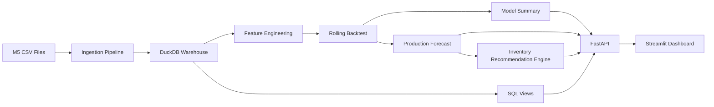
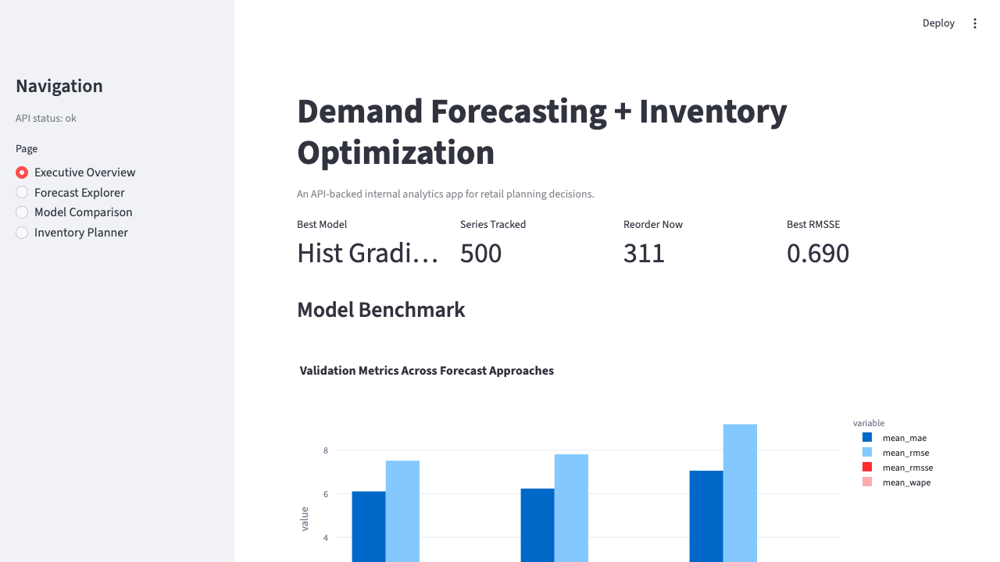
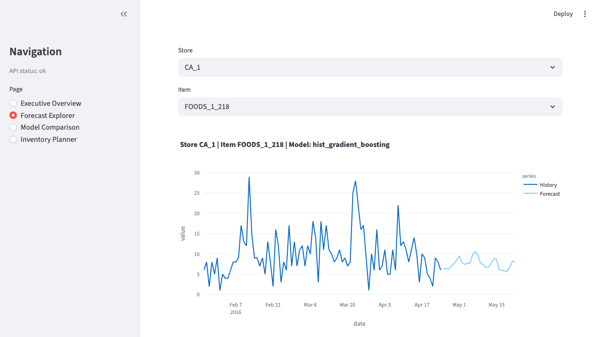

# Demand Forecasting + Inventory Optimization System

A production-style retail analytics project that turns historical sales into demand forecasts and reorder recommendations.

This repository is designed to look and behave like a real internal decision-support tool:

- a reproducible data pipeline built on DuckDB and SQL
- a 3-model forecast benchmark using a shared rolling backtest
- an API layer for serving metrics, forecasts, and recommendations
- a Streamlit dashboard for planners and managers

The goal is not just model accuracy. The goal is to answer a business question:

**What should a retail manager order next, and why?**

## What The System Does

1. Ingests raw M5 retail data from `data/raw/m5`
2. Filters to the top 50 items by historical demand
3. Builds a `store-item-day` warehouse table in DuckDB
4. Engineers lag, rolling, calendar, SNAP, event, and price features
5. Benchmarks 3 forecast approaches:
   - seasonal naive baseline
   - Holt-Winters exponential smoothing
   - HistGradientBoostingRegressor
6. Compares models with:
   - MAE
   - RMSE
   - RMSSE
   - WAPE as a supplemental business-facing metric
7. Selects one production model family for v1
8. Generates inventory recommendations with:
   - lead time demand
   - safety stock
   - reorder point
   - days of cover
   - case-pack rounded recommended order quantity
9. Serves results through FastAPI and visualizes them in Streamlit

## Why RMSSE Instead Of MAPE

MAPE can behave badly when actual demand is zero or close to zero, which happens often in retail item-store series.

RMSSE is a better fit here because it:

- normalizes error by each series' historical scale
- supports comparison across fast-moving and slow-moving items
- aligns with M5-style retail forecasting conventions

WAPE is still included because it is easier to explain to business stakeholders.

## Architecture



## Validated V1 Results

The current `v1` build has already been run end to end on the real M5 dataset subset used by this project.

- Historical window: `2011-01-29` to `2016-04-24`
- Forecast horizon: `28` days from `2016-04-25` to `2016-05-22`
- Warehouse size: `956,500` daily sales rows across `500` store-item series
- Production forecast output: `14,000` forecast rows
- Selected production model: `HistGradientBoostingRegressor`
- Best validation metrics:
  - `MAE = 6.10`
  - `RMSE = 7.51`
  - `RMSSE = 0.690`
  - `WAPE = 2.04` (supplemental business-facing metric)
- Inventory actionability: `311` series were flagged for reorder in the latest recommendation run

## Project Structure

```text
.
|-- data/raw/m5
|-- docs/interview-guide.md
|-- sql/
|-- src/retail_forecasting/
|   |-- api/
|   |-- dashboard/
|   |-- forecasting/
|   `-- pipeline/
|-- tests/
|-- Dockerfile.api
|-- Dockerfile.dashboard
`-- docker-compose.yml
```

## Expected Raw Data

Place these files inside `data/raw/m5`:

- `calendar.csv`
- `sell_prices.csv`
- `sales_train_validation.csv`

## Quick Start

### 1. Create a virtual environment

```bash
python3 -m venv .venv
source .venv/bin/activate
```

### 2. Install dependencies

```bash
pip install '.[dev]'
```

### 3. Run the full pipeline

```bash
retail-forecast run-all
```

This creates:

- DuckDB warehouse tables in `outputs/warehouse/m5.duckdb`
- model metadata in `outputs/artifacts/model_metadata.json`
- production forecasts and inventory recommendations in DuckDB tables

### 4. Start the API

```bash
retail-forecast serve-api
```

### 5. Start the dashboard

```bash
streamlit run src/retail_forecasting/dashboard/app.py
```

## CLI Commands

```bash
retail-forecast ingest
retail-forecast train
retail-forecast recommend
retail-forecast run-all
retail-forecast serve-api
```

## SQL Visibility

SQL is intentionally part of the project story, not hidden behind Python:

- [sales_trends.sql](sql/sales_trends.sql)
- [demand_seasonality.sql](sql/demand_seasonality.sql)
- [model_evaluation_summary.sql](sql/model_evaluation_summary.sql)
- [inventory_risk.sql](sql/inventory_risk.sql)

## API Endpoints

- `GET /health`
- `GET /catalog`
- `GET /metrics`
- `GET /forecast?store_id=&item_id=&horizon=`
- `GET /recommendations?store_id=`
- `GET /series/{store_id}/{item_id}`

## Dashboard Views

- Executive overview with KPI cards
- Forecast explorer for a store-item series
- Model comparison for MAE, RMSE, RMSSE, and WAPE
- Inventory planner with reorder recommendations

## Screenshots

### Executive Overview



### Forecast Explorer



## Inventory Logic In V1

This version intentionally keeps the inventory math simple and easy to explain:

- `lead_time_demand = sum of forecast demand over lead time`
- `safety_stock = z(service_level) * validation_rmse * sqrt(lead_time_days)`
- `reorder_point = lead_time_demand + safety_stock`
- `days_of_cover = current_on_hand / mean_daily_forecast`
- `recommended_order_qty = max(reorder_point - current_on_hand, 0)` rounded up to case pack

This is enough to demonstrate business decision-making without drifting into unrealistic cost optimization.

## Testing

Run the test suite with:

```bash
pytest
```

The test suite covers:

- metric calculations
- leakage-safe feature engineering
- inventory formulas and case-pack rounding
- API response shapes
- an end-to-end pipeline smoke test on a synthetic M5-like dataset

## Docker

Run the API and dashboard with Docker Compose:

```bash
docker compose up --build
```

## Resume-Friendly Project Story

You can describe this project in one sentence like this:

> Built a retail demand forecasting and inventory optimization system using Python, SQL, DuckDB, FastAPI, and Streamlit to forecast item-store demand and convert predictions into reorder recommendations.

For deeper interview prep, see [interview-guide.md](docs/interview-guide.md).
